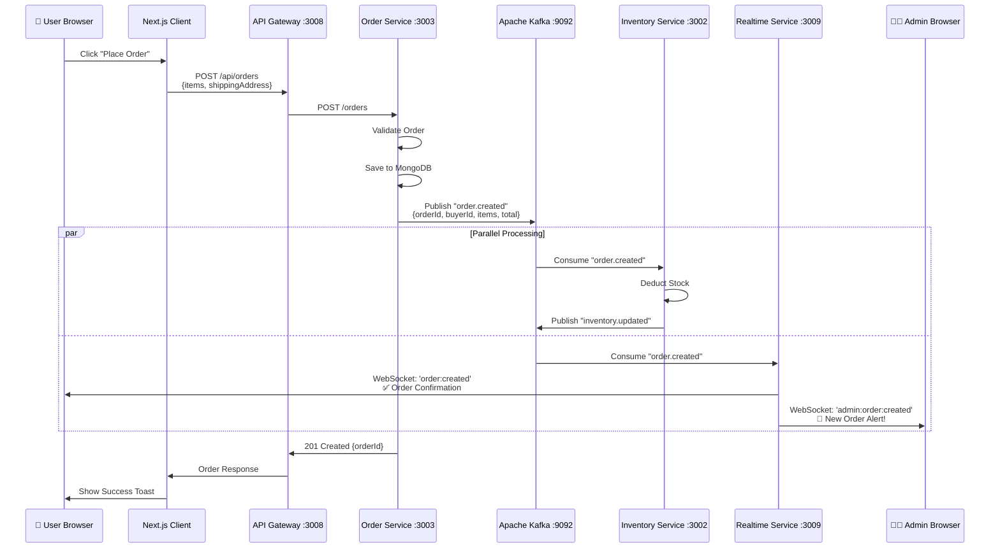
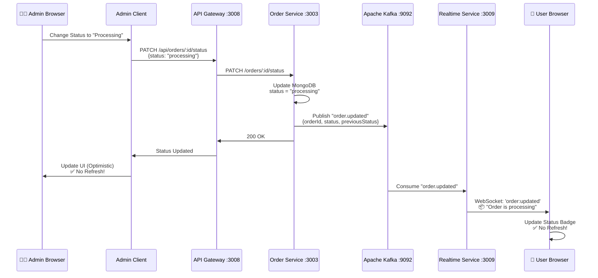
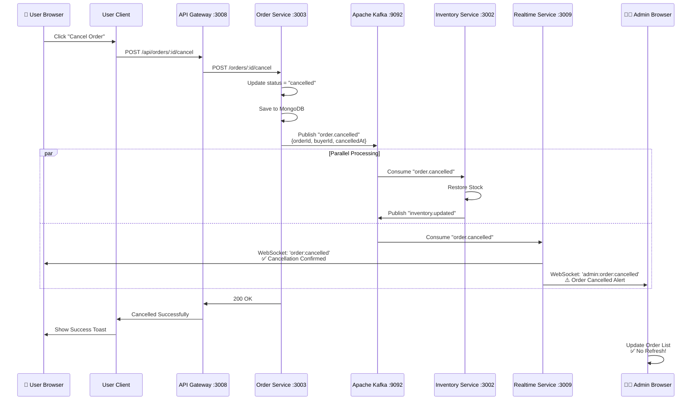
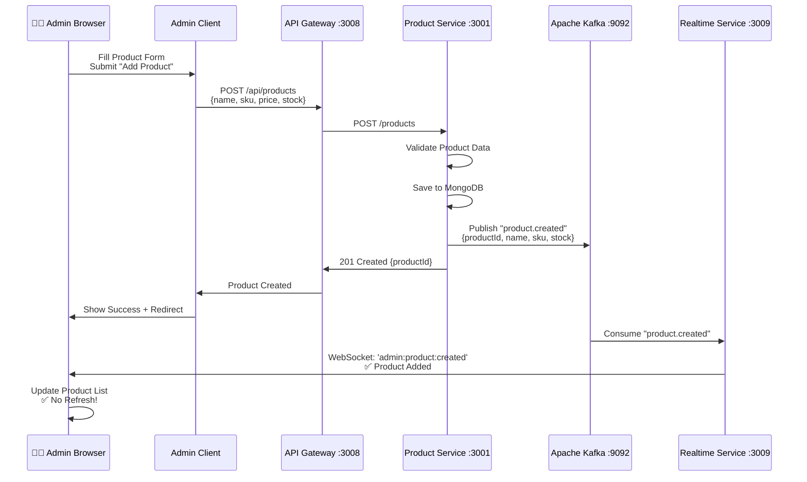
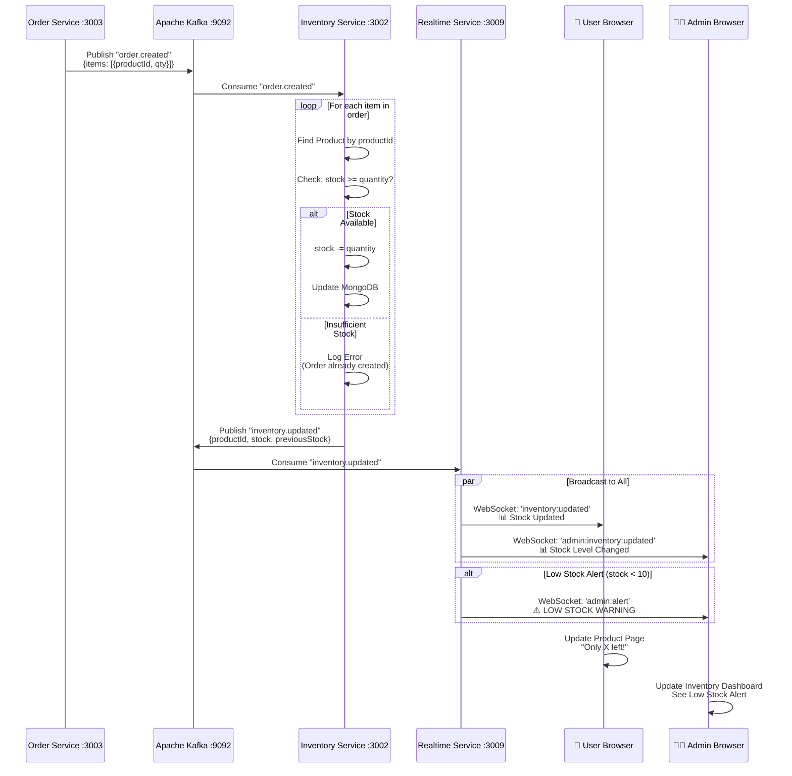
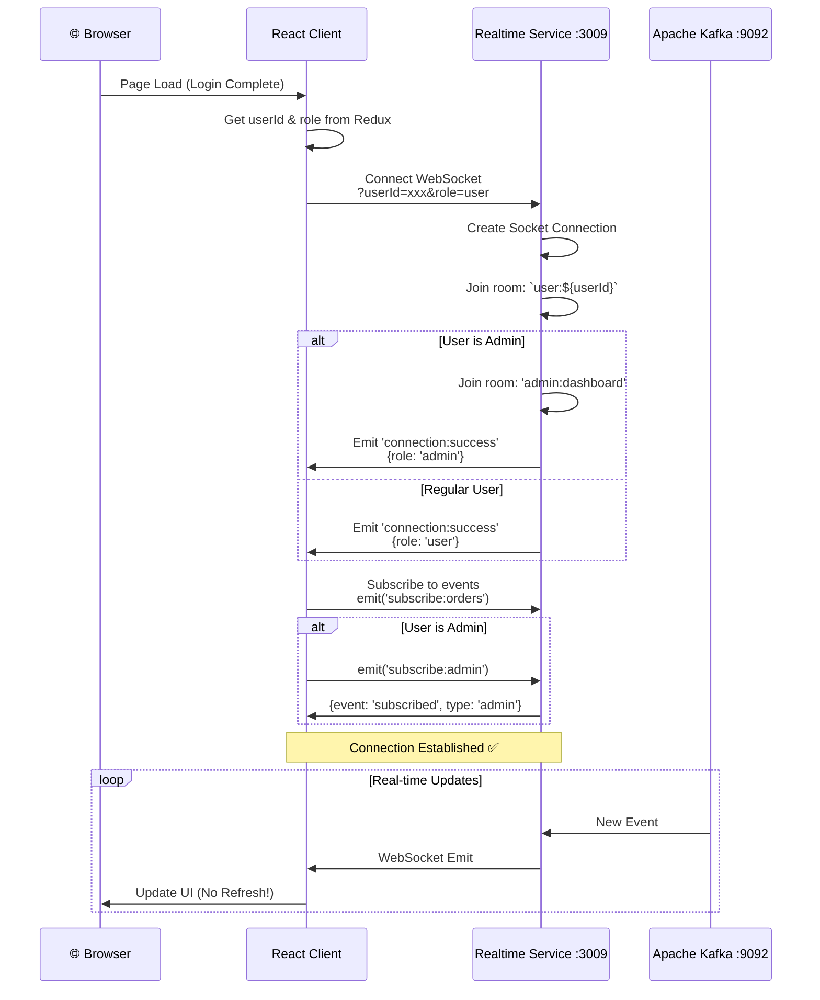

# 📊 Sequence Diagrams - Order & Product Flows

## 1. Complete Order Creation Flow

## 2. Admin Updates Order Status

## 3. User Cancels Order

## 4. Product Creation & Inventory Flow

## 5. Stock Deduction After Order

## 6. WebSocket Connection Flow

## Key Takeaways

### 🔄 Three Communication Patterns

1. **HTTP/REST (Blue arrows)**
   - Request → Response
   - Synchronous
   - Client ↔ Gateway ↔ Services

2. **Kafka Events (Orange arrows)**
   - Publish → Subscribe
   - Asynchronous
   - Service → Service communication
   - Decoupled & scalable

3. **WebSocket (Green arrows)**
   - Bidirectional
   - Real-time push
   - Server → Client updates
   - No polling needed

### ⚡ Real-Time Magic

All updates happen **WITHOUT PAGE REFRESH** because:
1. Services publish events to Kafka
2. Realtime Service consumes events
3. Realtime Service pushes to connected WebSocket clients
4. React updates UI with new data

### 🎯 Why It Works

- **Scalable**: Multiple services can consume same Kafka event
- **Reliable**: Kafka persists events, replay capability
- **Fast**: WebSocket has low latency (<100ms)
- **Decoupled**: Services don't talk directly to each other
- **Real-time**: Users see updates instantly

